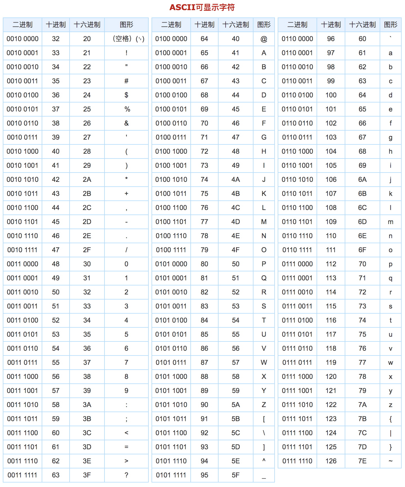

# ES5/String

## this 关键字

this 只能出现在作用域里面

this一般都是出现在函数内部

全局作用域下的this 永远都是window

```
var a=10
console.log(this)
```

函数中的this：

- 不一样的函数里面的this也是不一样的

直接以 函数名() 调用的，this就是window

```
function fn(){
    console.log(this)  //window
}
fn()

var fun=function(){
    console.log(this)  //window
}
fun()

var obj={
    fn:function(){
        console.log(this)  //window
    }
}
//obj 这个对象中的fn成员存储的是一个函数地址
//把这个函数地址赋值给a
// a存储的也是一个函数地址
var a=obj.fn
a()
```

写 对象名.函数名()  调用的this都是 . 前面的对象

```
function fn(){
    console.log(this)  //Object
}

var fun=function(){
    console.log(this)  //Object
}
//在obj这个对象里定义了一个成员fn,这个成员地址就是一个函数地址
//obj的fn成员可以当作函数来调用
var obj={
    fn:function(){
        console.log(this)  //Object
    },
    //把全局fn函数的地址给了obj的fn2成员
    //obj的fn2成员存储的就是fn函数的地址
    fn2:fn,
    fn3:fun
}
obj.fn()
obj.fn2()
obj.fn3()
```

使用事件调用的函数时，this指向的是事件源

```
<div id='box'>点击</div>
<script>
function fn(){
    console.log(this)  //<div id='box'>点击</div>
}
var fun=function(){
    console.log(this)  //<div id='box'>点击</div>
}
//在obj这个对象里定义了一个成员fn,这个成员地址就是一个函数地址
//obj的fn成员可以当作函数来调用
var obj={
    fn:function(){
        console.log(this)  //Object
    }
}
//使用事件调用的函数叫作事件处理函数
//函数内部的this指向的是事件源
box.onclick=function(){
    console.log(this) //<div id='box'>点击</div>
}
box.onclick=fn
box.onclick=fun
box.onclick=obj.fn
</script>
```


## 严格模式（了解）

- 除了正常运行模式，ECMAscript5添加了第二种运行模式："严格模式"（strict mode）。顾名思义，这种模式使得Javascript在更严格的条件下运行。 
- 设立"严格模式"的目的，主要有以下几个：   
  -  消除JavaScript语法的一些不合理、不严谨之处，减少一些怪异行为;    
  - 消除代码运行的一些不安全之处，保证代码运行的安全；    
  - 提高编译器效率，增加运行速度；    
  - 为未来新版本的JavaScript做好铺垫。 进入"严格模式"的标志："use strict"; 


### 开启严格模式

- 想开启严格模式，直接在代码最开始的位置写上字符串 `use strict`

  ```html
  <script>
  	'use strict'
  	// 下面代码书写就要按照严格模式来书写
  </script>
  ```


### 严格模式的规则

1. 声明变量必须有 `var` 关键字

   ```javascript
   'use strict'
   
   var num = 100
   num2 = 200 // 这个就会报错
   ```

   - 之前了解过，在声明变量的时候，如果没有 var 关键字，那么按照作用域的规则会自动定义成全局变量
   - 严格模式下不可以，会报错

2. 函数的行参不可以重复

   ```javascript
   'use strict'
   
   function fn(p1, p1) {} // 直接就会报错
   ```

   - 在非严格模式下，函数两个行参一样，是不会报错的，只不过就是相当于在函数内部只有一个变量了
   - 但是在严格模式下会报错

3. 声明式函数调用的时候函数内部没有 this

   ```javascript
   'use strtic'
   
   function fn() {
     console.log(this) // undefined
   }
   fn()
   ```

   - 本身，全局声明式函数在调用的时候，函数内部的 this 是指向 window 的
   - 在严格模式下，是没有 this 的

```
ES5严格模式的限制规范：

1.变量声明必须使用var，否则报错

2.对不合理的操作显示报错，不再做静默失败处理

3.禁止对象属性重名（IE）

4.禁止函数参数重名

5.禁止使用以0开头的八进制数字
ES6新的语法标准，八进制以0o来表示，与16进制的0x形成统一的语法格式

6.禁止使用with语句

7.强制为eval创建新作用域
eval() 函数计算 JavaScript 字符串，并把它作为脚本代码来执行。
如果参数是一个表达式，eval() 函数将执行表达式。
如果参数是Javascript语句，eval()将执行 Javascript 语句。
严格模式为JavaScript程序创建了第三种作用域：eval作用域

8.arguments不再追踪参数变化
var x = 1
function fn1(x) {
    x = 2;
    arguments[0] = 3;
    alert(x);
}
fn1(4);

9.禁止使用arguments.callee
// 在匿名的递归函数中
var factorialArray = [1, 2, 3, 4, 5].map(function(n) {
return (n < 2) ? 1 : arguments.callee(n - 1) * n;
});
console.log(factorialArray);

10.禁止this指向全局对象window，this变成undefined

11.函数必须声明在整个脚本或函数层面

12.新增一些保留字，不能使用他们作为标识符命名
implements, interface, let, package, private, protected, public, static, yield
```


## 创建字符串（了解）

- 我们创建字符串也分为两种方法 **字面量** 和 **构造函数**

- 字面量： 

  ```javascript
  var str = 'hello'
  ```

- 构造函数创建

  ```javascript
  var str = new String('hello')
  ```


## 编码字符集 （了解）

```
编码字符集：（简称字符集，如ASCII、GBK、Unicode）
编码字符集，用一个编码值来表示一个字符在库表中的位置，这个值称为字符对应于编码字符集的序号。

ASCII码是一套编码规则，规定了常用符号用哪些二进制数来表示。

ASCII码占用一个字节，可以有0～255共256个取值。前128个为常用的字符如运算符，字母 ，数字等键盘上可以显示的，后 128个为特殊字符是键盘上找不到的字符。

ASCII编码主要针对的是英语，全世界有上百种语言，中国制定了GB2312编码，日本制定了Shift_JIS编码，韩国制定了Euc-kr编码...

各国有各国的标准，就会不可避免地出现冲突，结果就是，在多语言混合的文本中，显示出来会有乱码。

Unicode编码把所有语言都统一到一套编码里，这样就不会再有乱码问题了！

Unicode 编码是一个很大的集合，现在的规模可以容纳100多万个符号。
Unicode 编码开头的 128 个和 ASCII 编码一样。
编码字符集Unicode，有UTF-8、UTF-16、UTF-32等多种字符编码。
```

- 
- 
- 上面的就是 ASCII 对照表，我们只需要知道他是这么存储的就好

## 字符串的常用方法

- 我们操作字符串，也有一堆的方法来帮助我们操作
- 字符串和数组有一个一样的地方，也是按照索引来排列的


### charAt

- `charAt(索引)`  是找到字符串中指定索引位置的内容返回

  ```javascript
  var str = 'Jack'
  
  // 使用 charAt 找到字符串中的某一个内容
  var index = str.charAt(2)
  
  console.log(index) // c
  ```

  - 因为字符串也是按照索引进行排列的，也是同样从 0 开始
  - 所以索引 2 的位置就是 c

- 如果没有对应的索引，那么就会返回 空字符串

  ```javascript
  var str = 'Jack'
  
  // 使用 charAt 找到字符串中的某一个内容
  var index = str.charAt(10)
  
  console.log(index) // ''
  ```

  - 这个字符串根本没有索引 10 的位置
  - 所以就会返回一个空字符串 `''`


### charCodeAt

- `charCodeAt(索引)` 就是返回对应索引位置内容的 unicode 编码

  ```javascript
  var str = 'Jack'
  
  // 使用 charAt 找到字符串中的某一个内容
  var index = str.charCodeAt(0)
  
  console.log(index) // 74
  ```

  - 因为 `J` 在 unicode 对照表里面存储的是 74，所以就会返回 74


### indexOf

- `indexOf` 就是按照字符找到对应的索引，从左往右查询

  ```javascript
  var str = 'Jack'
  
  // 使用 indexOf 找到对应的索引
  var index = str.indexOf('J')
  
  console.log(index) // 0
  ```

  - 因为字符 `J` 在字符串 `Jack` 中的索引位置是 0
  - 所以会返回 0

### lastIndexOf() 

- lastIndexOf 返回指定文本在字符串中*最后*一次出现的索引 

  ```
  var str = "The full name of China is the People's Republic of China.";
  var pos = str.lastIndexOf("China");
  ```

  注：如果未找到文本， indexOf() 和 lastIndexOf() 均返回 -1 

### slice() 

- slice() 提取字符串的某个部分并在新字符串中返回被提取的部分。

  该方法设置两个参数：起始索引（开始位置），终止索引（结束位置）。

  ```
  var str = "Apple, Banana, Mango";
  var res = str.slice(7,13); 
  res 的结果是：Banana
  ```

  如果某个参数为负，则从字符串的结尾开始计数。

  这个例子裁剪字符串中位置 -12 到位置 -6 的片段：

  ```
  var str = "Apple, Banana, Mango";
  var res = str.slice(-13,-7);
  res 的结果是：Banana
  ```

  

### substring

- `substring` 是用来截取字符串使用的

- 语法： `substring(从哪个索引开始，到哪个索引截止)`，包含开始索引，不包含结束索引

  ```javascript
  var str = 'hello'
  //         01234
  
  // 使用 substring 截取字符串
  var newStr = str.substring(1, 3)
  
  console.log(newStr) // el
  ```

  - 从索引 1 开始，到索引 3 截止，包含前面的索引不包含后面的索引
  - 所以返回的是 el

substring() 类似于 slice()。

不同之处在于 substring() 无法接受负的索引。

### substr

- `substr` 也是用来截取字符串的

- 语法：`substr(从哪个索引开始，截取多少个)`

  ```javascript
  var str = 'hello'
  //         01234
  
  // 使用 substr 截取字符串
  var newStr = str.substr(1, 3)
  
  console.log(newStr) // ell
  ```

  - 这个方法和 `substring` 不一样的是，第二个参数是截取多少个
  - 从索引 1 开始，截取 3 个，所以得到的是 `ell`

substr() 类似于 slice()。

不同之处在于第二个参数规定被提取部分的*长度*。

### replace

- 用另一个值替换在字符串中指定的值 

```
str = "Please visit Microsoft and Microsoft!";
var n = str.replace("Microsoft", "W3School");
console.log(n)  //Please visit W3School and Microsoft!
```

默认地，replace() *只替换首个匹配* 

- replace() 对大小写敏感 

```
str = "Please visit Microsoft!";
var n = str.replace("MICROSOFT", "W3School");
console.log(n)  //Please visit Microsoft!
```

如需执行大小写不敏感的替换，请使用正则表达式 /i（大小写不敏感） 

```
str = "Please visit Microsoft!";
var n = str.replace(/MICROSOFT/i, "W3School");
console.log(n)  //Please visit W3School!
```

如需替换所有匹配，请使用正则表达式的 g 标志 

```
str = "Please visit Microsoft and Microsoft!";
var n = str.replace(/Microsoft/g, "W3School");
console.log(n)  //Please visit W3School and W3School!
```

### concat 

- 连接两个或多个字符串 

```
var text1 = "Hello";
var text2 = "World";
text3 = text1.concat(" ",text2);
console.log(text3) //Hello World
```

### trim

- 删除字符串两端的空白符 

```
var str = "       Hello World!        ";
alert(str.trim());
```

### split 

- 字符串分割，将字符串转换为数组 

```
var txt = "a,b,c,d,e";   // 字符串
txt.split(",");          // 用逗号分隔
txt.split(" ");          // 用空格分隔
txt.split("|");          // 用竖线分隔
```

如果省略分隔符，被返回的数组将包含 index [0] 中的整个字符串。

如果分隔符是 ""，被返回的数组将是间隔单个字符的数组：

```
var txt = "Hello";       // 字符串
txt.split("");           // 分隔为字符
```


### toLowerCase 和 toUpperCase

- 这两个方法分别使用用来给字符串转成 小写字母 和 大写字母 的

  ```javascript
  var str = hello
  
  // 使用 toUpperCase 转换成大写
  var upper = str.toUpperCase()
  
  console.log(upper) // HELLO
  
  // 使用 toLowerCase 转换成小写
  var lower = upper.toLowerCase()
  
  console.log(lower) // hello
  ```

  

